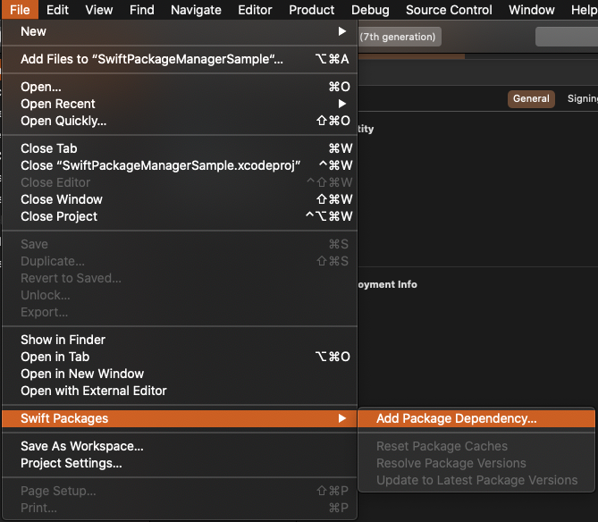
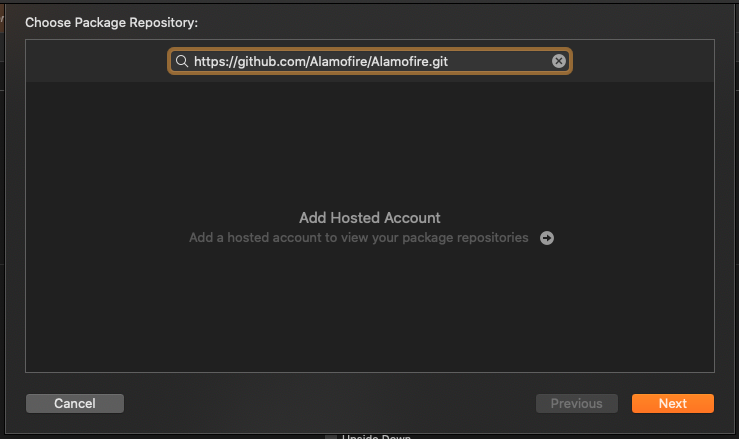
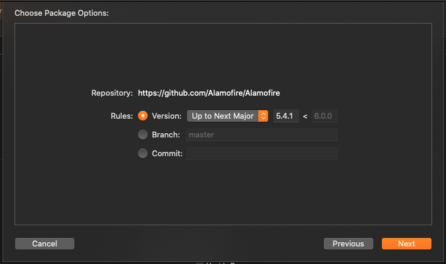
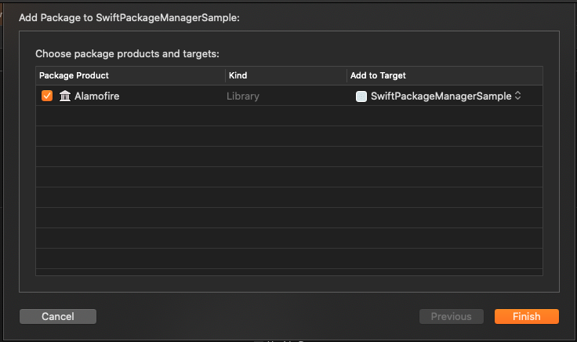

# SwiftPackageManagerSample

## SwiftPackageManagerとは

Swiftのソースコードで構成されたパッケージを、依存関係を解決しつつ利用できるようにしてくれる、Apple製のパッケージ管理ツール。
コマンドなど使う必要がないので、導入が簡単。

## 導入手順

### 1.File → Swift Packages → Add Package Dependency

### 2.リポジトリのURLを入力する

### 3.バージョンを選択する。

※ブランチやコミットも選択できる。

### 4.TARGETを選択する。

